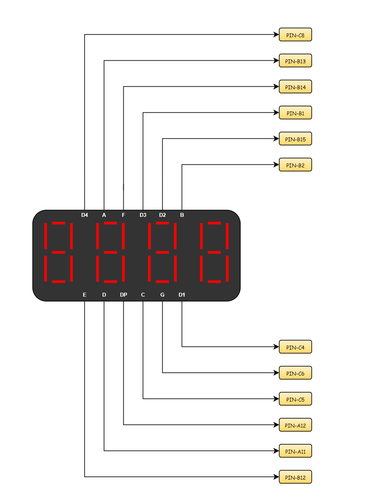
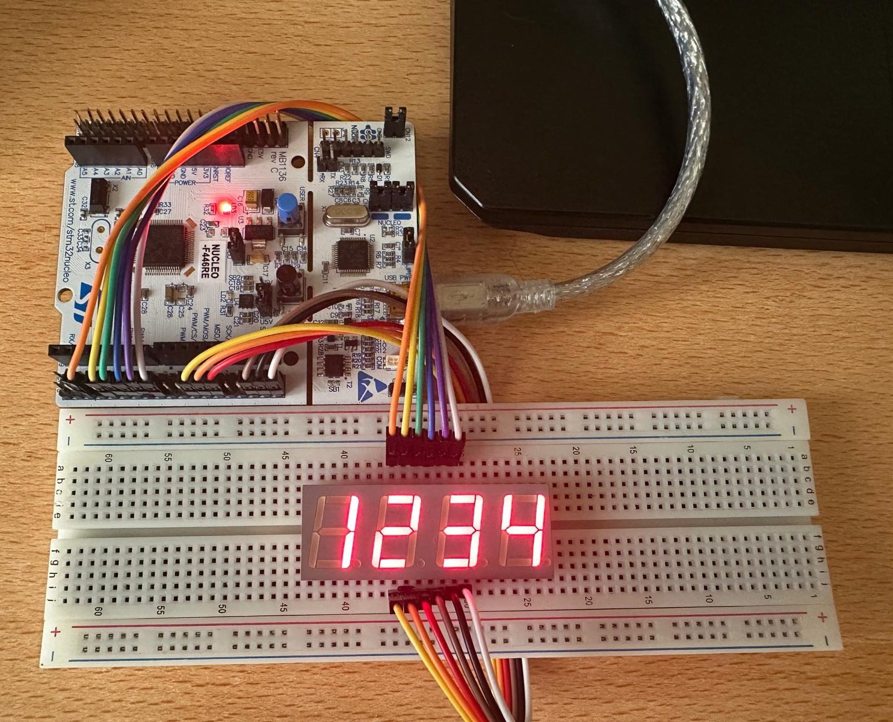

# Driver Development of 7-Segment 4-Digit Display on STM32 

# ⚡ What is 7-Segment 4-Digit Display?

7-Segment 4-Digit Display is an electronic module composed of four seven-segment digits, each formed by LEDs arranged to display numbers 0–9 and some characters. It is commonly used in clocks, counters, and calculators for simple and clear numeric output. The digits are usually driven by multiplexing, which reduces power consumption while keeping the display readable.

# 🔥 How to Use an 7-Segment 4-Digit Display with Microcontrollers?

Using a 7-Segment 4-Digit Display, connect its segment and digit control pins to the microcontroller’s GPIOs. Use multiplexing to activate one digit at a time rapidly, creating the illusion that all digits are lit simultaneously. Finally, control the segments according to the number or character you want to display.

# 🛠️ Electrical Diagram

- **D1 (Digit 1 Control Pin)** 

Controls the first digit (leftmost). Setting HIGH or LOW (depending on common-anode/cathode) turns the digit ON or OFF.

- **D2 (Digit 2 Control Pin)** 

Controls the second digit. Used in multiplexing to select which digit is active.

- **D3 (Digit 3 Control Pin)** 

Controls the third digit. Activated during multiplexing to display its corresponding number.

- **D4 (Digit 4 Control Pin)** 

Controls the fourth digit. Only one digit is usually active at a time in multiplexing.

- **A (Segment A Pin)** 

Controls segment A of all digits, forming part of the displayed number.

- **B (Segment B Pin)** 

Controls segment B of all digits, forming part of the displayed number.

- **C (Segment C Pin)** 

Controls segment C of all digits, forming part of the displayed number.

- **D (Segment D Pin)** 

Controls segment D of all digits, forming part of the displayed number.

- **E (Segment E Pin)** 

Controls segment E of all digits, forming part of the displayed number.

- **F (Segment F Pin)** 

Controls segment F of all digits, forming part of the displayed number.

- **G (Segment G Pin)** 

Controls segment G of all digits, forming part of the displayed number.

- **DOT (Decimal Point Pin)** 

Controls the decimal point segment of all digits. Can be turned ON or OFF independently.

In this application, the STM32 Nucleo F446RE development board was used. You can refer to the above wiring diagram.

# 🚀 Code Explanation

<pre><code class="language-c">void DISPLAY_init(TIM_HandleTypeDef * hTIMx, GPIO_TypeDef* D1_GPIO, uint16_t  D1_PIN,
										     GPIO_TypeDef* D2_GPIO, uint16_t  D2_PIN,
										     GPIO_TypeDef* D3_GPIO, uint16_t  D3_PIN,
										     GPIO_TypeDef* D4_GPIO, uint16_t  D4_PIN,
										     GPIO_TypeDef* A_GPIO, uint16_t  A_PIN,
										     GPIO_TypeDef* B_GPIO, uint16_t  B_PIN,
										     GPIO_TypeDef* C_GPIO, uint16_t  C_PIN,
										     GPIO_TypeDef* D_GPIO, uint16_t  D_PIN,
										     GPIO_TypeDef* E_GPIO, uint16_t  E_PIN,
										     GPIO_TypeDef* F_GPIO, uint16_t  F_PIN,
										     GPIO_TypeDef* G_GPIO, uint16_t  G_PIN,
										     GPIO_TypeDef* DOT_GPIO, uint16_t  DOT_PIN);
</code></pre>

This function initializes a 4-digit 7-segment display by assigning GPIO pins for digits (D1–D4) and segments (A–G, DOT), starts a timer for multiplexing, and sets all digit pins LOW and segment pins HIGH for common-anode wiring.

The timer is configured with prescaler 7499, counter period 24, and auto-reload preload enabled to generate periodic interrupts that handle rapid digit scanning.

<pre><code class="language-c">void DISPLAY_allSegmentON(void);
</code></pre>

This function turns on all four digits of the 7-segment display by setting D1–D4 pins HIGH.

<pre><code class="language-c">void DISPLAY_allSegmentOFF(void);
</code></pre>

This function turns off all four digits of the 7-segment display by setting D1–D4 pins LOW.

<pre><code class="language-c">void DISPLAY_allSegmentBlink(void);
</code></pre>

This function blinks all digits by toggling D1–D4 pins and turns on all segments by setting their GPIO pins LOW.

<pre><code class="language-c">void DISPLAY_selectDigit(uint8_t digit);
</code></pre>

This function activates a specific digit (1–4) on the 7-segment display by setting its pin HIGH and turning off the others.

<pre><code class="language-c">void DISPLAY_writeDigit(uint8_t number);
</code></pre>

This function lights up the segments corresponding to a given digit (0–9) to display that number on the 7-segment display.

<pre><code class="language-c">void DISPLAY_write(volatile uint16_t number);
</code></pre>

This function splits a number into individual digits, stores them in the display buffer, and sets the scan time while ignoring leading zeros.

# 🖥️ Test Highlights

You can easily test the 7-Segment 4-Digit Display using the following code snippet

<pre><code class="language-c">#include "main.h"
#include "DISPLAY.h"

TIM_HandleTypeDef htim2;
extern DISPLAY_TypeDef_t DISPLAY;

void SystemClock_Config(void);
static void MX_GPIO_Init(void);
static void MX_TIM2_Init(void);

void HAL_TIM_PeriodElapsedCallback(TIM_HandleTypeDef *htim)
{
    if (htim->Instance == TIM2)
    {
    	DISPLAY_allSegmentOFF();
    	if(DISPLAY.tempCounter <= DISPLAY.scanTime){
    	   DISPLAY_writeDigit(DISPLAY.digitBuffer[DISPLAY.tempCounter]);
    	   DISPLAY_selectDigit(DISPLAY.tempCounter + 1);
    	}
    	DISPLAY.tempCounter++;
    	if(DISPLAY.tempCounter > DISPLAY.scanTime){
    	   DISPLAY.tempCounter = 0;
    	}
    }
}

int main(void)
{
  HAL_Init();
  SystemClock_Config();
  MX_GPIO_Init();
  MX_TIM2_Init();
  DISPLAY_init(&htim2, GPIOC, GPIO_PIN_8,
		  	           GPIOB, GPIO_PIN_1,
			           GPIOB, GPIO_PIN_15,
			           GPIOC, GPIO_PIN_4,
			           GPIOB, GPIO_PIN_13,
			           GPIOB, GPIO_PIN_2,
			           GPIOC, GPIO_PIN_5,
			           GPIOA, GPIO_PIN_11,
			           GPIOB, GPIO_PIN_12,
			           GPIOB, GPIO_PIN_14,
			           GPIOC, GPIO_PIN_6,
			           GPIOA, GPIO_PIN_12);

  DISPLAY_write(1234);

  while (1)
  {
  }
}
</code></pre>

## 🎉 Thank You for Reviewing!

Thank you for taking the time to check out this project.

Feel free to follow me on these platforms for more updates and projects.

- YouTube: @mnane34

- LinkedIn: Mertcan Nane